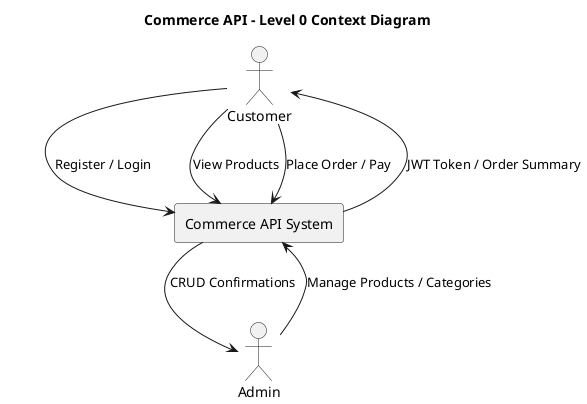
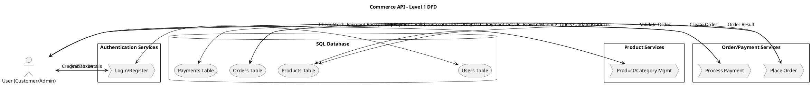
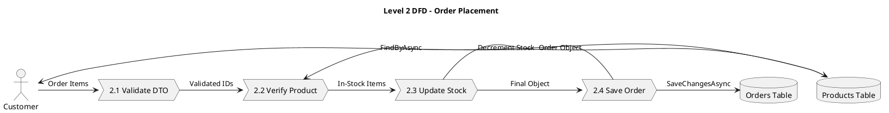
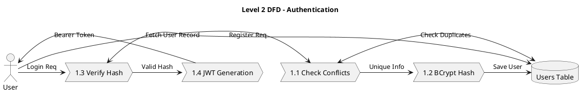
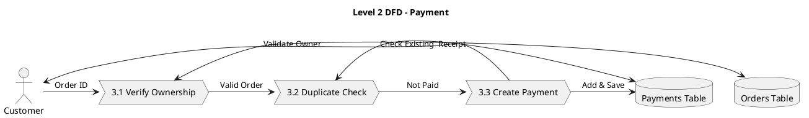

# Commerce API - Data Flow Diagram (DFD) Report

This report documents the data architectural flow of the Commerce API across three levels of detail.

---

## 🌐 Level 0: Context Diagram
The highest level view showing how external actors interact with the system boundary.

---

## 📂 Level 1: Process Diagram
Shows the data flow between the major service modules and the central SQL database.

---

## 🔍 Level 2: Detailed Process Breakdowns
Deep-dive into the internal logic of specific service methods.

### 2A. Order Placement (OrderService.PlaceOrderAsync)

### 2B. Authentication (AuthService)

### 2C. Payment Processing (PaymentService)

